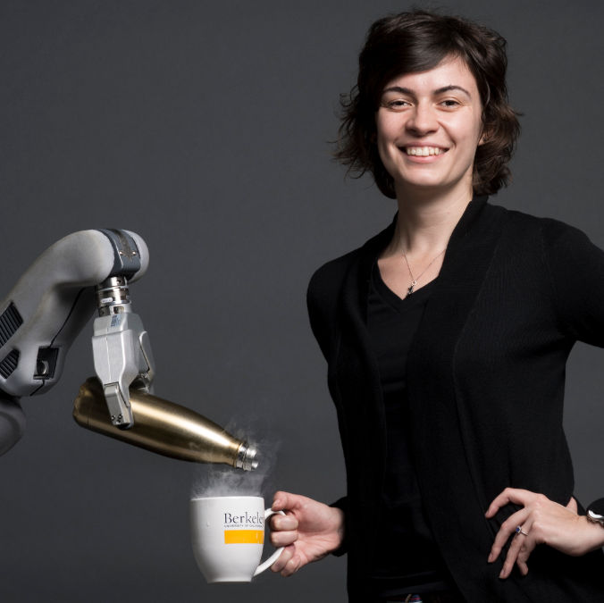
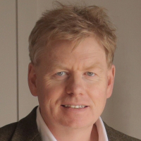
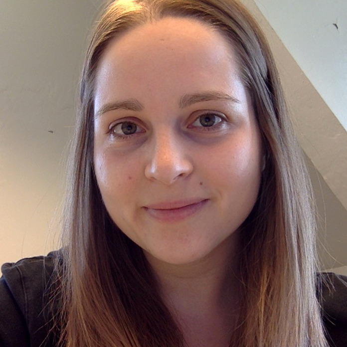

<!--

<h3 style="font-color: darkgreen;">NEWS: Camera-ready of accepted papers & speakers slides are online</h3>

----
-->
<a name="toc"/>

<a href="#overview">Overview</a> &middot;
<a href="#debaters">Invited Debaters</a> &middot;
<a href="#topics">Debate Topics</a> &middot;
<a href="#structure">Debate Structure</a> &middot;
<a href="#call">Call for Contributions</a> &middot;
<a href="#dates">Important Dates</a> &middot;
<a href="#papers">Accepted Papers</a> &middot;
<a href="#schedule">Schedule</a> &middot;
<!--<a href="#venue">Venue</a> &middot;-->
<a href="#organizers">Organizers</a>

----

<a name="toc"/>

Previous Workshops:
<a href="./rss2019">RSS 2019</a>

----

## Updates

2020-07-14: **Post-Workshop Update 2**. We have uploaded all recordings of both the debates and panel discussion: <a href="#videos">Videos</a>

2020-07-13: **Post-Workshop Update 1**. We'd love to send a thanks out to all debaters, authors, and participants that helped make this workshop so great! Thanks folks! :) Also we've uploaded the poster teasers that the authors provided (see <a href="#papers">Accepted Papers</a>).

<a name="videos"/>
## Videos <a href="#toc" class="top-link">[Top]</a>

<table>
<tr>
<td width="25%">
<iframe width="188" height="101" src="https://www.youtube.com/embed/Q-rsvVr2CjE?list=PLKUnyDCkD3O_BHMiGuP7V38KEUSzVGJb0" frameborder="0" allow="accelerometer; autoplay; encrypted-media; gyroscope; picture-in-picture" allowfullscreen></iframe>
</td>

<td width="25%">
<iframe width="188" height="101" src="https://www.youtube.com/embed/yHDnv-v6Dj4?list=PLKUnyDCkD3O_BHMiGuP7V38KEUSzVGJb0" frameborder="0" allow="accelerometer; autoplay; encrypted-media; gyroscope; picture-in-picture" allowfullscreen></iframe>
</td>

<td width="25%">
<iframe width="188" height="101" src="https://www.youtube.com/embed/S8zfYrlahac?list=PLKUnyDCkD3O_BHMiGuP7V38KEUSzVGJb0" frameborder="0" allow="accelerometer; autoplay; encrypted-media; gyroscope; picture-in-picture" allowfullscreen></iframe>
</td>

<td width="25%">
<iframe width="188" height="101" src="https://www.youtube.com/embed/x5hnD1grtLw?list=PLKUnyDCkD3O_BHMiGuP7V38KEUSzVGJb0" frameborder="0" allow="accelerometer; autoplay; encrypted-media; gyroscope; picture-in-picture" allowfullscreen></iframe>
</td>

</tr>

<tr>
<td> Debate 1: Why Sim2Real? </td>
<td> Debate 2: What Is Sim2Real? </td>
<td> Debate 3: How to Sim2Real? </td>
<td> Panel discussion </td>
</tr>

</table>

<a name="overview"/>

## Overview <a href="#toc" class="top-link">[Top]</a>

Physical simulation is an important tool for robotics. While simulation has been well-established for robotics education and integrated robot software testing for a long time, only recently the robotics community has made significant progress in transferring capabilities learned in simulation to reality, a concept termed Sim2Real transfer.

Sim2Real refers to a concept of transferring robot skills acquired in simulation to the real robotic system. Sim2Real draws its appeal from the fact that it is cheaper, safer and more informative to perform experiments in simulation than in the real world -- yet, Sim2Real faces significant challenges.

In this workshop we invite well-known researchers to debate the state of the art and the impact of Sim2Real on robotics. The proposed workshop is the second edition of a <a href="./rss2019">workshop held at R:SS 2019</a>. The R:SS 2019 workshop had the goal of surveying the state of the art in Sim2Real for robotics, with a focus on robotic manipulation, and featured invited talks from top researchers in the field of Sim2Real. In this year’s edition, we aim to review the actual progress in Sim2Real more critically by changing the workshop format: inspired by the ICRA 2019 robotic debates workshop, for this workshop we will invite top-researchers to participate in debates focussed on controversial key topics with a few spotlight presentations.

<a name="debaters"/>

## Invited Debaters <a href="#toc" class="top-link">[Top]</a>

|  | [Chris Atkeson](https://www.cs.cmu.edu/~cga/) (Robotics Institute, Carnegie Mellon University)

|  | [Anca Dragan](https://people.eecs.berkeley.edu/~anca/) (UC Berkeley)

|  | [Gregory Dudek](http://www.cim.mcgill.ca/~dudek/) (McGill University)

|  | [Dieter Fox](https://homes.cs.washington.edu/~fox/) (University of Washington and Nvidia Research)

|  | [Ken Goldberg](https://goldberg.berkeley.edu/) (UC Berkeley and UCSF)

|  | [Abhinav Gupta](https://www.cs.cmu.edu/~abhinavg/) (Robotics Institute, Carnegie Mellon University)

|  | [John Leonard](https://www.csail.mit.edu/person/john-leonard) (MIT)

|  | [Karen Liu](https://ckllab.stanford.edu/c-karen-liu) (Georgia Tech)

|  | [Jan Peters](https://www.ias.informatik.tu-darmstadt.de/Member/JanPeters) (Technische Universität Darmstadt, MPI for Intelligent Systems)

|  | [Shuran Song](https://shurans.github.io/) (Columbia University)

|  | [Peter Welinder](http://www.vision.caltech.edu/welinder) (OpenAI)

|  | [Martha White](https://webdocs.cs.ualberta.ca/~whitem/) (University of Alberta)

<a name="topics"/>

## Debate Topics <a href="#toc" class="top-link">[Top]</a>

In contrast to the R:SS 2019 edition, we changed the format from invited talks to **debates**. Each debate will focus on a key - rather controversial - statement regarding Sim2Real, and will be discussed by two proponents and two opponents of that statement. Each debate consists of short introductory pitches by the two sides, providing an opportunity to presenters to also highlight their work, followed by a moderated discussion. An example list of statements includes:

> *Why* sim2real? - "Investing into Sim2Real is a waste of time and money“

> *What* is sim2real? - "Sim2Real is old news. It’s just X (X=model-based RL, X=domain randomization, X=system identification, ...)"

> *How* to sim2real? -  "For successful sim2real transfer, there is no alternative to accurate simulation.“

<a name="structure"/>

## Debate Structure <a href="#toc" class="top-link">[Top]</a>

We will adhere to the following debate structure (Total time per debate: 50 min)

1. Introductions (5 min = 4 debaters x ~1 min each)
2. Opening arguments (20 min = 4 debaters x 5 min each)
3. Moderated discussion between debaters (15 min)
4. Closing remarks (10 min = 4 debaters x 2.5 min each)

<a name="call"/>

## Call for Contributions <a href="#toc" class="top-link">[Top]</a>

Participants are invited to submit **extended abstracts (maximum 2 pages in length, excluding references)**. We encourage justified position papers (wrt. to the aforementioned debate points) but we allow other sim2real-related entries as long as they mention in the submission notes how they relate to one of the subjects (e.g. a work about a new visual grasping sim2real method might mention that it's ONLY reporting sim2sim performance since their simulation is sufficiently detailed).

Accepted abstracts will be given the opportunity to record a short pitch video, and receive an online Q&A slot during the live session of the virtual workshop.

* Submissions must not exceed *2 pages in length, excluding references*.
* Submissions must be in PDF following the IEEE style available from 
  [https://www.ieee.org/conferences/publishing/templates.html](https://www.ieee.org/conferences/publishing/templates.html)
* Submissions must include a short abstract. The *extended abstract* should go in the main section of the template and the *short abstract* in the abstract section.
* Anonymous submissions are not required.

**Submission website:** [https://cmt3.research.microsoft.com/SIMREALRM2020](https://cmt3.research.microsoft.com/SIMREALRM2020)

<a name="dates"/>

## Important dates <a href="#toc" class="top-link">[Top]</a>

* Submission Deadline: **June 26th, 2020** AoE time (UTC-12)
* Notification of Acceptance: **July 6th, 2020** <s>July 1st, 2020</s>
* Camera ready **and Video** submission: **July 8th, 2020**
* Workshop: July 12, 2020 (full day)

<a name="papers"/>

## Accepted Papers <a href="#toc" class="top-link">[Top]</a>

(ordered by title)

* **"Accurate High Fidelity Simulations for Training Robot Navigation Policies for Dense Crowds using Deep Reinforcement Learning"** 
Jing Liang, Utsav Patel, Adarsh Jagan Sathyamoorthy, Dinesh Manocha 
<a href="assets/papers/2020/liang.pdf">[PDF]</a> <a href="https://www.youtube.com/watch?v=3qAChP_6PVY">[Video]</a>
* **"An Imitation from Observation Approach to Sim-to-Real Transfer"** 
Siddharth Desai, Ishan Durugkar, Haresh Karnan, Garrett Warnell, Josiah Hanna, Peter Stone 
<a href="assets/papers/2020/desai.pdf">[PDF]</a> <a href="https://www.youtube.com/watch?v=CEEGJZJmDF8">[Video]</a>
* **"Augmenting Differentiable Simulators with Neural Networks to Close the Sim2Real Gap"** 
Eric Heiden, David Millard, Erwin Coumans, Gaurav Sukhatme 
<a href="assets/papers/2020/heiden.pdf">[PDF]</a> <a href="https://www.youtube.com/watch?v=awhkI5xtFa0">[Video]</a>
* **"BlenderProc: Reducing the Reality Gap with Photorealistic Rendering"** 
Maximilian Denninger, Martin Sundermeyer, Dominik Winkelbauer, Dmitry Olefir, Tomas Hodan, Youssef Zidan, Mohamad Elbadrawy, Markus Knauer, Harinandan Katam, Ahsan Lodhi 
<a href="assets/papers/2020/denninger.pdf">[PDF]</a> <a href="https://www.youtube.com/watch?v=tQ59iGVnJWM">[Video]</a>
* **"CuNAS - CUriosity-driven Neural-Augmented Simulator"** 
Sharath Chandra Raparthy, Melissa Mozifian, Liam Paull, Florian Golemo 
<a href="assets/papers/2020/raparthy.pdf">[PDF]</a> <a href="https://www.youtube.com/watch?v=Tlf5RG3OPF8">[Video]</a>
* **"Continual Learning on Incremental Simulations for Real-World Robotic Manipulation Tasks"** 
Josip Josifovski, Mohammadhossein Malmir, Noah Klarmann, Alois Knoll 
<a href="assets/papers/2020/josifovski.pdf">[PDF]</a> <a href="https://www.youtube.com/watch?v=UoJolTE6SMg">[Video]</a>
* **"How to Sim2Real with Gaussian Processes: Prior Mean versus Kernels as Priors"** 
Rika Antonova, Akshara Rai, Danica Kragic 
<a href="assets/papers/2020/antonova2.pdf">[PDF]</a> <a href="https://www.youtube.com/watch?v=LVRzfaAU2dw">[Video]</a>
* **"Learning Predictive Representations for Deformable Objects with Contrastive Estimation"** 
Wilson Yan, Ashwin Vangipuram, Pieter Abbeel, Lerrel Pinto 
<a href="assets/papers/2020/yan.pdf">[PDF]</a> <a href="https://www.youtube.com/watch?v=LLFfPbirwHk">[Video]</a>
* **"Learning to Manipulate Deformable Objects without Demonstrations"** 
Yilin Wu, Wilson Yan, Thanard Kurutach, Lerrel Pinto, Pieter Abbeel 
<a href="assets/papers/2020/wu.pdf">[PDF]</a> <a href="https://www.youtube.com/watch?v=nYCC2T_Tw-U">[Video]</a>
* **"Learning to Walk without Dynamics Randomization"** 
Jeremy Dao, Helei Duan, Kevin Green, Jonathan Hurst, Alan Fern 
<a href="assets/papers/2020/dao.pdf">[PDF]</a> <a href="https://www.youtube.com/watch?v=nyFA_s6NReA">[Video]</a>
* **"Modular Latent Space Transfer with Analytic Manifold Learning"** 
Rika Antonova, Maksim Maydanskiy, Danica Kragic, Sam Devlin, Katja Hofmann 
<a href="assets/papers/2020/antonova.pdf">[PDF]</a> <a href="https://www.youtube.com/watch?v=6J_J6kFemLM">[Video]</a>
* **"Necessity for More Realistic Contact Simulation"** 
Mabel Zhang 
<a href="assets/papers/2020/zhang2.pdf">[PDF]</a> <a href="https://www.youtube.com/watch?v=n24pH69mWjo">[Video]</a>
* **"On Assessing the Value of Simulation for Robotics"** 
Liam Paull, Anthony Courchesne 
<a href="assets/papers/2020/paull.pdf">[PDF]</a> <a href="https://www.youtube.com/watch?v=VsayHLDXWDg">[Video]</a>
* **"Online BayesSim for Combined Simulator Parameter Inference and Policy Improvement"** 
Rafael Possas, Fabio Ramos, Dieter Fox, Lucas Barcelos, Rafael Oliveira 
<a href="assets/papers/2020/possas.pdf">[PDF]</a> <a href="https://www.youtube.com/watch?v=PnT_dO745JY">[Video]</a>
* **"Robust Sim2Real Transfer by Learning Inverse Dynamics of Simulated Systems"** 
Mohammadhossein Malmir, Josip Josifovski, Noah Klarmann, Alois Knoll 
<a href="assets/papers/2020/malmir.pdf">[PDF]</a> <a href="https://www.youtube.com/watch?v=LyqMkguLDe8">[Video]</a>
* **"Sim2Real Learning of Vision-based Obstacle Avoidance for Robotic Manipulators"** 
Kefang Zhang, Tan Zhang, Jiatao Lin, Lv Bi 
<a href="assets/papers/2020/zhang.pdf">[PDF]</a> <a href="https://www.youtube.com/watch?v=7_d6nu0iV70">[Video]</a>
* **"Sim2Real Predictivity: Does Evaluation in Simulation Predict Real-World Performance?"** 
Abhishek Kadian, Joanne Truong, Aaron Gokaslan, Alexander Clegg, Erik Wijmans, Stefan Lee, Manolis Savva, Sonia Chernova, Dhruv Batra 
<a href="assets/papers/2020/kadian.pdf">[PDF]</a> <a href="https://www.youtube.com/watch?v=Hun2rhgnWLU">[Video]</a>
* **"The Importance and the Limitations of Sim2Real for Robotic Manipulation in Precision Agriculture"** 
Carlo Rizzardo, SUNNY KATYARA, Miguel Fernandes, Fei Chen 
<a href="assets/papers/2020/rizzardo.pdf">[PDF]</a> <a href="https://www.youtube.com/watch?v=gi-ffG6B5yA">[Video]</a>

<a name="schedule"/>

## Schedule <a href="#toc" class="top-link">[Top]</a>

Taking inspiration from the ICRA 2019 Debates on the Future of Robotics Research, the workshop will consist of three debates. Every debates focuses on a single key question and is structured as follows:
Poster teasers related to debate topic (3-5 minutes each depending on number)
Pitch by proponents (2 researchers), 15 minutes
Pitch by opponents (2 researchers), 15 minutes
Debate, 45 minutes

We will be soliciting poster submissions for the workshop. We will review the contributions by putting together a program committee with experts in the field. We will have two poster sessions during the coffee breaks along with teaser presentations.

We will conclude the workshop with a panel discussion focusing on the question on how Sim2Real and real-world experimentation can be combined in the best way to achieve the best of both worlds.

<iframe class="cal" src="https://docs.google.com/spreadsheets/d/e/2PACX-1vRK0fRQC4gP6nuXUvxKSfwrl-bJhn3SSMJrqArG1JrdnO1siDzuKBipDb20h8A4MirZ7PPppbY_NcLm/pubhtml?gid=0&amp;single=true&amp;widget=true&amp;headers=false"></iframe>

<!--
<a name="venue"/>

## Venue <a href="#toc" class="top-link">[Top]</a>

The workshop takes place in **Building 101, Room 00 026**.

The poster sessions takes place in **Building 101, Room 00 019**.

Please check out the [RSS website](http://roboticsconference.org/attending/venue/) and [Google maps](https://goo.gl/maps/2iwdEFKUh1m) for more detailed information on the workshop’s location.
-->

<a name="organizers"/>

## Organizers <a href="#toc" class="top-link">[Top]</a>

|  | [Sebastian Höfer](http://www.sebastianhoefer.de) is an applied scientist at Amazon Robotics AI headed by Siddhartha Srinivasa. Before joining Amazon, he received his Ph.D. with Oliver Brock at Technische Universität Berlin.

|   | [Kostas Bekris](https://robotics.cs.rutgers.edu/pracsys/members/kostas-bekris/) is an Associate Professor at the Computer Science department of Rutgers University and an Amazon Scholar at the Amazon Robotics AI team headed by Siddhartha Srinivasa. He received his PhD with Lydia Kavraki at Rice University.  |

|   | [Ankur Handa](https://ankurhanda.github.io/) is a senior research scientist at NVIDIA robotics lab run by Dieter Fox. Prior to that he was a research scientist at OpenAI. He received his Ph.D. with Dr. Andrew Davison and spent two years at University of Cambridge in Prof. Roberto Cipolla’s lab as a post-doctoral researcher.  |

|   | [Juan Camilo Gamboa](https://cim.mcgill.ca/~gamboa/ ) is a PhD Candidate at the School of Computer Science at McGill University. His research focuses on model-based RL for control and navigation of underwater vehicles.  |

|   | [Florian Golemo](https://fgolemo.github.io/) is a postdoctoral fellow at Mila and ElementAI, working with Liam Paull, Aaron Courville, and Chris Pal on Sim2Real and 3D perception problems. He received his PhD from INRIA Bordeaux under supervision of Pierre-Yves Oudeyer.  |

|   | [Melissa Mozifian](https://melfm.github.io/about.html) is a PhD Candidate at the School of Computer Science at McGill University. Her research focuses on deep reinforcement learning and transfer for control of robot manipulation tasks.  |
| &nbsp;&nbsp;&nbsp;&nbsp;&nbsp;&nbsp;&nbsp;&nbsp;&nbsp;&nbsp;&nbsp;&nbsp;&nbsp;&nbsp;&nbsp;&nbsp;&nbsp;&nbsp; | |

<!-- ## News -->
<!-- 
  <article>
    <h3 id="news-{{ forloop.index }}">
       {{ post.title }}
    </h3>
    

    <small>posted at <time datetime="{{ post.date | date: "%Y-%m-%d" }}">{{ post.date | date_to_long_string }}</time> &middot; by {{ post.user }}</small>
    

    {{ post.content }}
  </article>
 -->
