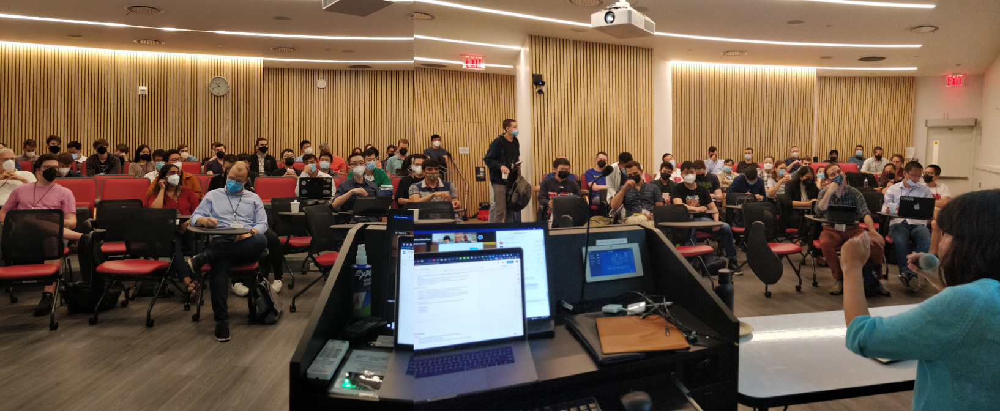
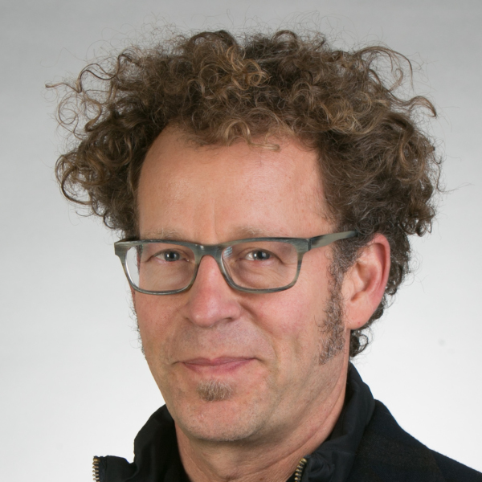
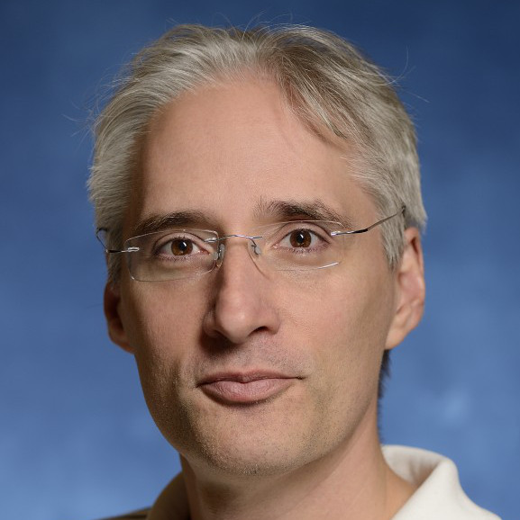
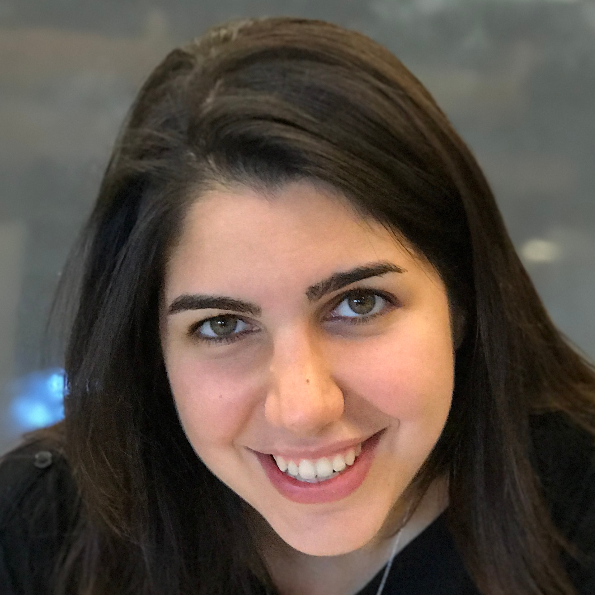

<!--

<h3 style="font-color: darkgreen;">NEWS: Camera-ready of accepted papers & speakers slides are online</h3>

----
-->
<a name="toc"/>

<a href="#videos">Videos</a> &middot;
<a href="#overview">Overview</a> &middot;
<a href="#debaters">Invited Debaters</a> &middot;
<a href="#call">Call for Contributions</a> &middot;
<a href="#dates">Important Dates</a> &middot;
<a href="#papers">Accepted Papers</a> &middot;
<a href="#schedule">Schedule</a> &middot;
<a href="#organizers">Organizers</a>

----

<a name="toc"/>

Previous Workshops:
<a href="./rss2020">RSS 2020</a> &middot; <a href="./rss2019">RSS 2019</a>

----

## Updates

**2022 July 5th: Post-Workshop Update 2**. Uploaded the videos of the debate and panel. See <a href="#videos">Videos</a>

**2022 June 28th: Post-Workshop Update 1**. We'd love to send a thanks out to all debaters, authors, and participants that helped make this workshop so great! Thanks folks, you're awesome! ❤️ Also we've uploaded the accepted papers in their preliminary version, see <a href="#papers">Accepted Papers</a>.

<!--
**2022 June 27th:** IMPORTANT: **GatherTown **link here (virtual poster session is 3:50-4:15PM): https://app.gather.town/app/E4ffpRVF5EkQOEld/RSS%20Sim2Real%20Wrkshp%202022
-->

**2022 June 27th:** Accepted papers will be posted on this page tonight. Added Greg Chirikjian in the 12:30-1pm slot as invited speaker.

**2022 June 25th:** Added Schedule and Ken Goldberg as invited speaker & panelist.

**2022 June 20th:** Added Hongzhuo as additional organizer.

**2022 May 3rd:** Added the CMT link and submission instructions. Submissions are now open. Also we're excited to add Dorsa Sadigh as in-person debater to the roster.

**2022 April:** Workshop got accepted 🎉, currently preparing CMT submission system and announcement. 
After 2 years of remote conferences, we're happy to announce that R:SS this year and by extension
this workshop will allow in-person attendance 🎉🎉🎉.

<a name="videos"/>
## Videos <a href="#toc" class="top-link">[Top]</a>

<table>

<tr>
<td width="50%">
<iframe width="340" height="184" src="https://www.youtube.com/embed/3-o22Q67c2I" title="YouTube video player" frameborder="0" allow="accelerometer; autoplay; clipboard-write; encrypted-media; gyroscope; picture-in-picture" allowfullscreen></iframe>
</td>

<td width="50%">
<iframe width="340" height="184" src="https://www.youtube.com/embed/pMx42rQDd4o" title="YouTube video player" frameborder="0" allow="accelerometer; autoplay; clipboard-write; encrypted-media; gyroscope; picture-in-picture" allowfullscreen></iframe>
</td>
</tr>

<tr>
<td align="center"> Debate:  Is Sim2Real Solved? </td>
<td align="center"> Panel Discussion:  What matters in Sim2Real?</td>
</tr>
<!--
<tr>
<td width="50%">
<iframe width="340" height="184" src="https://www.youtube.com/embed/S8zfYrlahac?list=PLKUnyDCkD3O_BHMiGuP7V38KEUSzVGJb0" frameborder="0" allow="accelerometer; autoplay; encrypted-media; gyroscope; picture-in-picture" allowfullscreen></iframe>
</td>

<td width="50%">
<iframe width="340" height="184" src="https://www.youtube.com/embed/x5hnD1grtLw?list=PLKUnyDCkD3O_BHMiGuP7V38KEUSzVGJb0" frameborder="0" allow="accelerometer; autoplay; encrypted-media; gyroscope; picture-in-picture" allowfullscreen></iframe>
</td>
</tr>

<tr>
<td align="center"> Debate 3:  How to Sim2Real? </td>
<td> Panel discussion </td>
</tr>
-->
</table>

<a name="overview"/>

## Overview <a href="#toc" class="top-link">[Top]</a>

Physical simulation is an important tool for robotics. While simulation has been well-established for robotics education and integrated robot software testing for a long time, only recently the robotics community has made significant progress in transferring capabilities learned in simulation to reality, a concept termed Sim2Real transfer.

Sim2Real refers to a concept of transferring robot skills acquired in simulation to the real robotic system. Sim2Real draws its appeal from the fact that it is cheaper, safer and more informative to perform experiments in simulation than in the real world -- yet, Sim2Real faces significant challenges.

In this workshop we invite well-known researchers to debate the state of the art and the impact of Sim2Real on robotics. In this workshop we invite well-known researchers to debate the state of the art and the impact of Sim2Real on robotics. The proposed workshop is the third edition of a <a href="./rss2019">workshop that happened at R:SS 2019</a> and at <a href="./rss2019">R:SS 2020</a>. In this year’s edition, we aim to review the actual progress in Sim2Real more critically by changing the workshop format: inspired by the ICRA 2019 robotic debates workshop, for this workshop we will invite top-researchers to participate in debates focussed on controversial key topics with a few spotlight presentations.

<a name="debaters"/>

## Invited Debaters & Speakers <a href="#toc" class="top-link">[Top]</a>

|  | [Daniela Rus](https://www.csail.mit.edu/person/daniela-rus/) (MIT)

|  | [David Hsu](https://www.comp.nus.edu.sg/~dyhsu/) (National University of Singapore)

|  | [Ken Goldberg](goldberg.berkeley.edu) (UC Berkeley)

|  | [Gregory Chirikjian](https://cde.nus.edu.sg/me/staff/chirikjian-gregory-s/) (National University of Singapore)

|  | [Fabio Ramos](https://fabioramos.github.io/Home.html) (Nvidia & University of Sydney)

|  | [Stefanie Tellex](https://cs.brown.edu/people/stellex/) (Brown University)

|  | [Animesh Garg](https://animesh.garg.tech/) (University of Toronto)

|  | [Dorsa Sadigh](https://dorsa.fyi//) (Stanford University)

|  | [Viktor](https://twitter.com/viktor_m81) [Makoviychuk](https://scholar.google.com/citations?user=rmAcDNkAAAAJ&hl=en) (Nvidia)

<a name="call"/>

## Call for Contributions <a href="#toc" class="top-link">[Top]</a>

Participants are invited to submit extended abstracts (maximum 2 pages in length, excluding references). We encourage both position papers as well general sim2real submissions.

Accepted abstracts will receive a poster presentation slot and selected submissions will additionally be allowed to give a spotlight presentation for 5min each, ahead of the debate that's most in line with the subject.

Submissions must be in PDF format following the [IEEE style](https://www.ieee.org/conferences/publishing/templates.html).  Submissions must include a short abstract. The extended abstract should go in the main section of the template and the short abstract in the abstract section.

Submission website: [https://cmt3.research.microsoft.com/Sim2Real2022/Submission/Index](https://cmt3.research.microsoft.com/Sim2Real2022/Submission/Index)

<a name="dates"/>

## Important dates <a href="#toc" class="top-link">[Top]</a>

* Paper Submission Deadline: May 31st, 2022
* Acceptance Notification: June 7th, 2022
* Workshop: June 27th, 2022 (full day)
* Main Conference: June 27th - July 1st, 2022

<a name="papers"/>

## Accepted Papers <a href="#toc" class="top-link">[Top]</a>

* **"A Framework for Curriculum Schema Transfer from Low-Fidelity to High-Fidelity Environments"** 
  Yash Shukla, Jivko Sinapov 
<a href="assets/papers/2022/shukla.pdf">[PDF]</a>

* **"A Recurrent Differentiable Physics Engine for Tensegrity Robots"** 
  Kun Wang, Mridul Aanjaneya, Kostas Bekris 
<a href="assets/papers/2022/wang.pdf">[PDF]</a>

* **"CaTGrasp: Learning Category-Level Task-Relevant Grasping from Simulation"** 
  Bowen Wen, Wenzhao Lian; Kostas Bekris; Stefan Schaal 
<a href="assets/papers/2022/wen.pdf">[PDF]</a>

* **"Closing the Sim-to-Real Gap for Ultra-Low-Cost, Resource-Constrained, Quadruped Robot Platforms"** 
  Jason Jabbour; Sabrina Neuman; Mark Mazumder; Colby Banbury; Shvetank Prakash; Brian Plancher; Vijay Janapa Reddi 
<a href="assets/papers/2022/jabbour.pdf">[PDF]</a>

* **"Learning Agile, Vision-based Drone Flight: from Simulation to Reality"** 
  Davide Scaramuzza, Elia Kaufmann 
<a href="#">(Sorry, PDF not available. Please reach out to Davide)</a>

* **"The gap in functional electrical stimulation simulation"** 
  Aran Sena; Hossein Kavianirad; Satoshi Endo; Etienne Burdet; Sandra Hirche 
<a href="assets/papers/2022/sena.pdf">[PDF]</a>

* **"Toward Real-World Implementation of Deep Reinforcement Learning for Vision-Based Autonomous Drone Navigation with Mission"** 
  Mozhgan Navardi; Prakhar Dixit; Tejaswini Manjunath; Nicholas R Waytowich; Tinoosh Mohseninn; Tim Oates 
<a href="assets/papers/2022/navardi.pdf">[PDF]</a>

* **"Towards Sim2Real for Shipwreck Detection in Side Scan Sonar Imagery"** 
  Advaith V Sethuraman; Katherine A Skinner 
<a href="assets/papers/2022/sethuraman.pdf">[PDF]</a>

<a name="schedule"/>

## Schedule <a href="#toc" class="top-link">[Top]</a>

<table class="tg">
<thead>
  <tr>
    <th class="tg-0thz" style="width:120px">Timeslot</th>
    <th class="tg-0thz">Event</th>
    <th class="tg-0thz">Speakers</th>
  </tr>
</thead>
<tbody>
  <tr>
    <td class="tg-lboi">09:00 - 09:10</td>
    <td class="tg-lboi">Welcome</td>
    <td class="tg-lboi"></td>
  </tr>
  <tr>
    <td class="tg-lboi">09:10 - 10:00</td>
    <td class="tg-lboi">Papers Session 1</td>
    <td class="tg-lboi">"Learning Agile, Vision-based Drone Flight: from Simulation to Reality", "Toward Real-World Implementation of Deep Reinforcement Learning for Vision-Based Autonomous Drone Navigation with Mission", "A Recurrent Differentiable Physics Engine for Tensegrity Robots", "Closing the Sim-to-Real Gap for Ultra-Low-Cost, Resource-Constrained, Quadruped Robot Platforms"</td>
  </tr>
  <tr>
    <td class="tg-lboi">10:00 - 10:30</td>
    <td class="tg-lboi">Coffee Break</td>
    <td class="tg-lboi"></td>
  </tr>
  <tr>
    <td class="tg-lboi">10:30 - 11:30</td>
    <td class="tg-lboi">Debate 1 - "Sim2Real is Solved"</td>
    <td class="tg-lboi">Dorsa Sadigh &amp;  David Hsu vs. Fabio Ramos &amp;  Animesh Garg </td>
  </tr>
  <tr>
    <td class="tg-lboi">11:30 - 12:30</td>
    <td class="tg-lboi">Papers Session 2</td>
    <td class="tg-lboi">"The gap in functional electrical stimulation simulation", "Towards Sim2Real for Shipwreck Detection in Side Scan Sonar Imagery", "CaTGrasp: Learning Category-Level Task-Relevant Grasping from Simulation", "A Framework for Curriculum Schema Transfer from Low-Fidelity to High-Fidelity Environments"</td>
  </tr>
  <tr>
    <td class="tg-lboi">12:30 - 13:00</td>
    <td class="tg-lboi">Invited Talk</td>
    <td class="tg-lboi">Updated: Gregory Chirikjian</td>
  </tr>
  <tr>
    <td class="tg-lboi">13:00 - 14:00</td>
    <td class="tg-lboi">Lunch break</td>
    <td class="tg-lboi"></td>
  </tr>
  <tr>
    <td class="tg-lboi">14:00 - 14:20</td>
    <td class="tg-lboi">Invited Talk</td>
    <td class="tg-lboi">Ken Goldberg (Real2Sim2Real)</td>
  </tr>
  <tr>
    <td class="tg-lboi">14:20 - 15:30</td>
    <td class="tg-lboi">Panel Discussion</td>
    <td class="tg-lboi">Viktor Makoviychuk,  Stefanie Tellex, Dorsa Sadigh, Ken Goldberg</td>
  </tr>
  <tr>
    <td class="tg-lboi">15:30 - 15:45</td>
    <td class="tg-lboi">Invited Talk</td>
    <td class="tg-lboi">Daniela Rus (Vista Simulator)</td>
  </tr>
  <tr>
    <td class="tg-lboi">15:45 - 15:50</td>
    <td class="tg-lboi">Closing</td>
    <td class="tg-lboi"></td>
  </tr>
  <tr>
    <td class="tg-lboi">15:50 - 16:15</td>
    <td class="tg-lboi">Coffee Break &amp; Virtual Poster Session</td>
    <td class="tg-lboi"></td>
  </tr>
</tbody>
</table>

<!--
[//]: # ()
[//]: # (Taking inspiration from the ICRA 2019 Debates on the Future of Robotics Research, the workshop will consist of three debates. Every debates focuses on a single key question and is structured as follows:)

[//]: # (Poster teasers related to debate topic &#40;3-5 minutes each depending on number&#41;)

[//]: # (Pitch by proponents &#40;2 researchers&#41;, 15 minutes)

[//]: # (Pitch by opponents &#40;2 researchers&#41;, 15 minutes)

[//]: # (Debate, 45 minutes)

[//]: # ()
[//]: # (We will be soliciting poster submissions for the workshop. We will review the contributions by putting together a program committee with experts in the field. We will have two poster sessions during the coffee breaks along with teaser presentations.)

[//]: # ()
[//]: # (We will conclude the workshop with a panel discussion focusing on the question on how Sim2Real and real-world experimentation can be combined in the best way to achieve the best of both worlds.)

[//]: # ()
[//]: # ()
[//]: # (<iframe class="cal" src="https://docs.google.com/spreadsheets/d/e/2PACX-1vRK0fRQC4gP6nuXUvxKSfwrl-bJhn3SSMJrqArG1JrdnO1siDzuKBipDb20h8A4MirZ7PPppbY_NcLm/pubhtml?gid=0&amp;single=true&amp;widget=true&amp;headers=false"></iframe>)

[//]: # ()
[//]: # (<!--)

[//]: # (<a name="venue"/>)

[//]: # ()
[//]: # (## Venue <a href="#toc" class="top-link">[Top]</a>)

[//]: # ()
[//]: # (The workshop takes place in **Building 101, Room 00 026**.)

[//]: # ()
[//]: # (The poster sessions takes place in **Building 101, Room 00 019**.)

[//]: # ()
[//]: # (Please check out the [RSS website]&#40;http://roboticsconference.org/attending/venue/&#41; and [Google maps]&#40;https://goo.gl/maps/2iwdEFKUh1m&#41; for more detailed information on the workshop’s location.)
-->
<a name="organizers"/>

## Organizers <a href="#toc" class="top-link">[Top]</a>

|   | [Florian Golemo](https://fgolemo.github.io/) is a postdoctoral fellow at Mila and ServiceNow, working with Liam Paull and Chris Pal on Sim2Real and 3D perception problems. He received his PhD from INRIA Bordeaux under supervision of Pierre-Yves Oudeyer.  |

|   | [Melissa Mozifian](https://melfm.github.io/about.html) is a PhD Candidate at the School of Computer Science at McGill University. Her research focuses on deep reinforcement learning and transfer for control of robot manipulation tasks.  |

|   | [Hongzhuo Liang](https://tams.informatik.uni-hamburg.de/people/liang/) is a PhD Candidate at the University of Hamburg, Germany. He has completed his PhD defense in May 2022 and will work as a postdoc at the University of Hamburg. His research focuses on robotic grasping and multimodal deep reinforcement learning for different robotic manipulation skills.  |

|   | [Ankur Handa](https://ankurhanda.github.io/) is a senior research scientist at NVIDIA robotics lab run by Dieter Fox. Prior to that he was a research scientist at OpenAI. He received his Ph.D. with Dr. Andrew Davison and spent two years at University of Cambridge in Prof. Roberto Cipolla’s lab as a post-doctoral researcher.  |

|   | [Kostas Bekris](https://robotics.cs.rutgers.edu/pracsys/members/kostas-bekris/) is an Associate Professor at the Computer Science department of Rutgers University and an Amazon Scholar at the Amazon Robotics AI team headed by Siddhartha Srinivasa. He received his PhD with Lydia Kavraki at Rice University.  |

<!--

[//]: # (|   | [Juan Camilo Gamboa]&#40;https://cim.mcgill.ca/~gamboa/ &#41; is a PhD Candidate at the School of Computer Science at McGill University. His research focuses on model-based RL for control and navigation of underwater vehicles.  |)
-->

